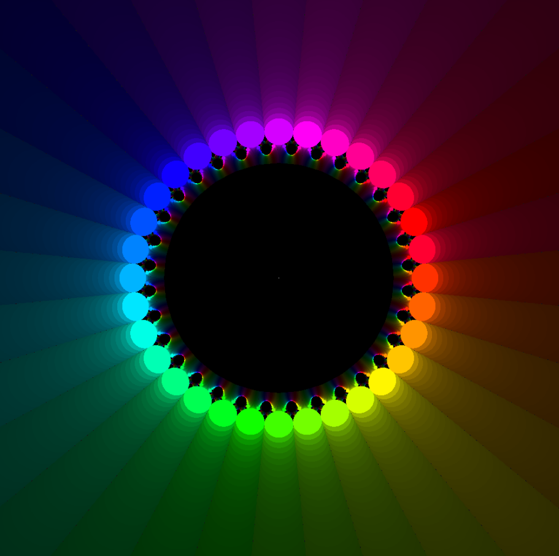

# Newton Fractal Visualization

This project generates Newton Fractals for the equation `z^n - 1 = 0` using **C++** and **ISPC**.
Each pixel represents a complex number `z₀`, and its color corresponds to which root Newton’s method converges to, as well as how many iterations it takes to reach that root.

## Features

* Configurable polynomial degree `n`.
* Configurable image resolution and number of iterations.
* Parallelized computation using **ISPC** for performance.
* Visualizes the complex plane in the square **(-2, -2) → (2, 2)**.

## Requirements

* C++ compiler supporting C++11 or newer.
* ISPC compiler.
* Linux (or any environment with `g++` and `ispc` installed).

## Building

Clone the repository and run:

```bash
make
```

This will compile both the ISPC code and the C++ host code, producing the executable `main`.

## Usage

Run the program with:

```bash
./main <degree> <width> <max_iterations> <output.ppm>
```

* `degree` – the `n` in `z^n - 1 = 0`
* `width` – image width in pixels (height is automatically set equal to width)
* `max_iterations` – maximum iterations for Newton’s method
* `output.ppm` – name of the output file

### Example

```bash
./main 5 1000 500 fractal.ppm
```

This generates a 1000×1000 Newton Fractal for `z^5 - 1 = 0`, performing up to 500 iterations, and saves it as `fractal.ppm`.

## Output Details

* The program writes the image in **PPM (P6)** format, viewable with most image viewers (e.g., `eog`, `display`, or `GIMP`).
* The visualized region of the complex plane covers **(-2, -2)** to **(2, 2)**.
* Parallel computation is implemented in `image_generate.ispc`, while `main.cpp` handles image generation and file output.

## Project Structure

```
.
├── main.cpp              # Main C++ host code
├── image_generate.ispc   # ISPC parallel implementation
├── makefile              # Build script
└── README.md             # Project documentation
```

## Example Renders

### Newton Fractal n = 3 (500 iterations)


### Newton Fractal n = 7 (500 iterations)


### Newton Fractal n = 32 (2000 iterations)


